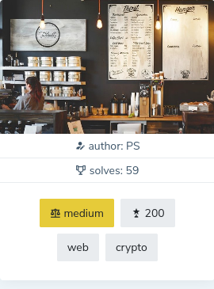

## Cafe Shop
They have good things at the cafe shop, but I want a COLA - DECAF it must be!
Visit the shop here:

http://46.101.107.117:2104

Note: The service is restarted every hour at x:00.

### Hint:
They also serve hash browns, for $256.

## How-to:
* finding: sha256(POST param) contains order name in hex speak (cafe, c01a, beef)
* idea: find an item ID for "COLA DECAF" (=name) so that sha256(ID + name) in hex contains "c01a" and "decaf"

impremented in cafe.py
