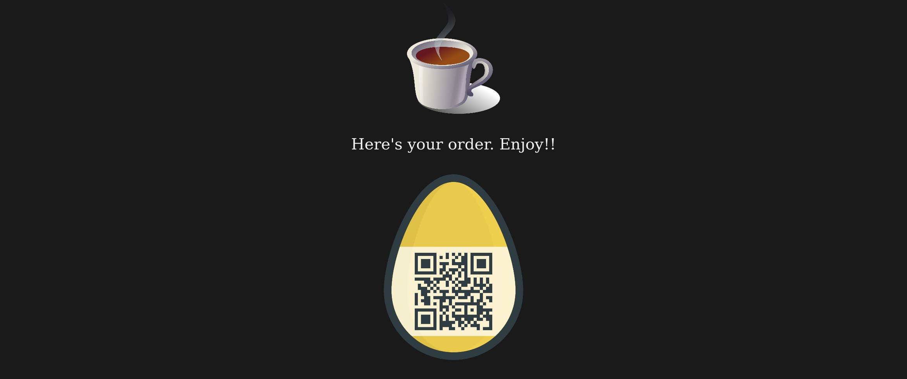

## Cafe Shop
They have good things at the cafe shop, but I want a COLA - DECAF it must be!
Visit the shop here:

http://46.101.107.117:2104

Note: The service is restarted every hour at x:00.

### Hint:
They also serve hash browns, for $256.

## How-to:
* interpreting hint: SHA256…?
* finding: sha256(<POST param id value>) contains part of order name in [Hexspeak](https://en.wikipedia.org/wiki/Hexspeak) (0xcafe, 0xc01a, 0xbeef):
```bash
  $ for i in "42640575 Cherry Cola" "11865457 Vanilla Cafe" "80427209 Beef Jerky" ; do echo -n "sha256(\"$i\")=" && echo -n "$i" | sha256sum -t; done
  sha256("42640575 Cherry Cola")=36bc94f7d7c3398319f2c01a9a9c583aed66d3a5e325aafa0652ceb2bdc271cf  -
  sha256("11865457 Vanilla Cafe")=f15bffb719f26892f17eea53dc7e3459cafe021bc0db2dce72429667d7aaee96  -
  sha256("80427209 Beef Jerky")=ed734b4fc622d543774121dcfb573cf53d7ddef85ebebeef9fd7cbd8bf4363c9  -
```
* assumption: backend works somehow like this:
```python3
  def process_order(post_param_id):
    hash = sha256(post_param_id)
    for h in products_hexspeak_map.keys():
      if h in hash:
        return products_hexspeak_map[h]
      else:
        return "Sorry, but we don't have that."
```
  … and we have to order "COLA DECAF" …
* idea: find an item **ID** for "COLA DECAF" (=name) so that sha256(ID + name) in hex contains "c01a" and "decaf"
* **solution implemented in [cafe.py](cafe.py) ☑**
* it finds ```37374099 COLA DECAF``` which's sha256 hash contains ```decaf``` and ```c01a```:
  ```f5ba3332710abaf7d01decaff966e3e6cc579a5274f8be9cf3442d3c01a373fb```
* when POST-requesting ```id=37374099+COLA+DECAF``` we receive:
  
