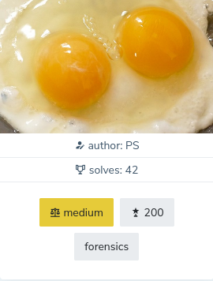

## Two Yolks
This egg has two yolks.
But the second seems to be hidden somehow.

## Solution
* I've tried typical stegano tools but they all failed.
* then I began taking the chall description more seriously
* and looked into [PNG specifications](https://www.w3.org/TR/2003/REC-PNG-20031110/#11CcGen)
* after reading about chunks I've had a deeper look into the file and discovered two _unknown_ chunks ```YHDR``` and ```YDAT```
* assuming that they could actually just be regular ```IHDR``` and ```IDAT``` chunks, only renamed (Y for Yolk) to hide them from the decoder, 
* I wondered if I can extract and create a new PNG file just with them.
* So I made a copy of the file, 
* opened it in HexEditor (Ghex) 
* and removed the ```IHDR``` and ```IDAT```chunks, 
* renamed ```YHDR``` and ```YDAT``` into ```IHDR``` and ```IDAT```
* recalculated chunk lengths and the CRC 
* and saved the file, 
* tada:


